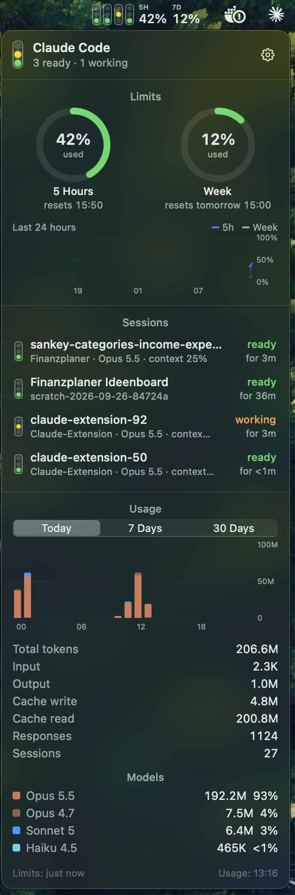

# ClaudeBar

**Know which Claude Code session needs you, without switching windows.**

ClaudeBar puts a small traffic light for each Claude Code session in your macOS menu bar, next to your plan limits.
Click it for sessions, limits and token usage at a glance.

[](https://github.com/LHner1/claude-bar/releases/latest)

[](LICENSE)

<p align="center">
  
</p>

## What you get

- 🔴 🟡 🟢 **One light per session.** Red = needs you, yellow = working, green = ready for your next prompt.
- **Jump to the session.** Click it and its terminal comes to the front (in iTerm2 and Terminal.app, the exact tab).
- **Plan limits.** 5-hour and weekly usage with reset times and a 24-hour chart.
- **Token usage.** Tokens per hour, day and model for today, 7 or 30 days.
- **A status line for Claude Code:** `Opus · my-repo ⎇ main · ctx 17% · 5h 38% ↻2h52m · 7d 12%`
- **100% local.** No network, no telemetry.

Needs macOS 14+ and Claude Code with a Pro or Max plan (limits are only reported for subscriptions).

## Install

**Homebrew**

```bash
brew install --cask lhner1/tap/claude-bar
/Applications/ClaudeBar.app/Contents/Resources/statusline.sh enable
open /Applications/ClaudeBar.app
```

The second line connects ClaudeBar to the Claude Code status line, which is where the limits come from.
Already have a status line? It keeps working; ClaudeBar just reads along.

**Download:** grab [ClaudeBar.zip](https://github.com/LHner1/claude-bar/releases/latest/download/ClaudeBar.zip),
move the app to `/Applications` and run the same `statusline.sh enable` line.

**From source** (needs Xcode or `xcode-select --install`):

```bash
curl -fsSL https://raw.githubusercontent.com/LHner1/claude-bar/main/install.sh | bash
```

Want it on every login? Gear menu → **Launch at Login**.

<details>
<summary><b>macOS says it can't verify ClaudeBar?</b></summary>

<br>

ClaudeBar is a hobby project without a paid Apple Developer account, so downloads aren't notarized.
Open it once anyway:

- **System Settings → Privacy & Security → Open Anyway**, or
- `xattr -dr com.apple.quarantine /Applications/ClaudeBar.app`

Homebrew does this for you, and source builds never ask. Every release is built from the tagged source by a
[public workflow](.github/workflows/release.yml), with the SHA-256 attached.

</details>

## How it works

ClaudeBar only reads files Claude Code already writes on your Mac:

| What | Where it comes from |
| --- | --- |
| Session status | `~/.claude/sessions/*.json` |
| Plan limits | the data Claude Code passes to its [status line](https://code.claude.com/docs/en/statusline) |
| Token usage | token counts in `~/.claude/projects/**/*.jsonl` (message content is never read) |

Limits refresh while a session is running; otherwise you see the last known values.
The first click on a session asks for permission to control your terminal, so ClaudeBar can pick the right tab.

<details>
<summary><b>Privacy & security details</b></summary>

<br>

- No network access: nothing leaves your Mac.
- From transcripts only token counts, model and timestamp are used.
- Files in `~/.claude/claude-bar/` are private to your user (`0700`/`0600`).
- Signed with the hardened runtime, which blocks code injection.
- AppleScript only selects a terminal tab; it never types anything.
- Setup only touches the `statusLine` key in `~/.claude/settings.json` and keeps a backup.

</details>

## Uninstall

```bash
/Applications/ClaudeBar.app/Contents/Resources/statusline.sh disable   # restores your old status line
brew uninstall --cask claude-bar                                        # add --zap to delete its data too
```

Installed from source? Run `./uninstall.sh` (or `--purge` to delete its data too).

## Development

```bash
./scripts/build-app.sh                         # builds build/ClaudeBar.app
open build/ClaudeBar.app --args --show-popup   # launches with the popup open
```

A plain Swift package: `ClaudeBar` (the app) and `claude-bar-statusline` (the helper inside it).
Shipping a new version: see [docs/RELEASING.md](docs/RELEASING.md).

---

Unofficial community project, not affiliated with Anthropic. Claude Code's local file formats may change.
[MIT License](LICENSE).
